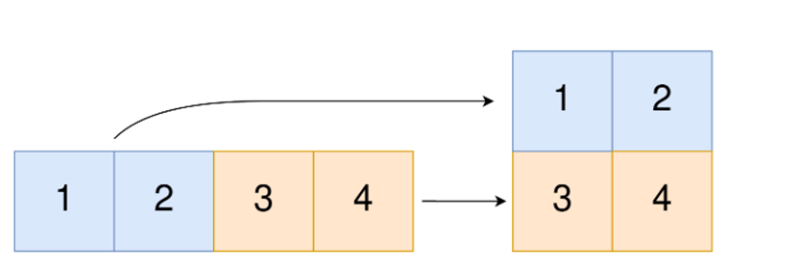
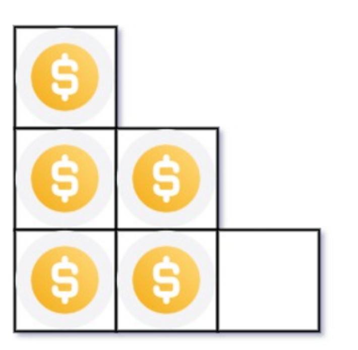

Q1. Convert 1D Array Into 2D Array

You are given a **0-indexed** 1-dimensional (1D) integer array original, and two integers, m and n. You are tasked with creating a 2-dimensional (2D) array with  m rows and n columns using **all** the elements from original.

The elements from indices 0 to n - 1 (**inclusive**) of original should form the first row of the constructed 2D array, the elements from indices n to 2 * n - 1 (**inclusive**) should form the second row of the constructed 2D array, and so on.

Return *an* m x n *2D array constructed according to the above procedure, or an empty 2D array if it is impossible*.

**Example 1:**



**Input:** original = [1,2,3,4], m = 2, n = 2

**Output:** [[1,2],[3,4]]

**Explanation:** The constructed 2D array should contain 2 rows and 2 columns.

The first group of n=2 elements in original, [1,2], becomes the first row in the constructed 2D array.

The second group of n=2 elements in original, [3,4], becomes the second row in the constructed 2D array.

**Solution 1:**

```javascript
function construct2DArray(original, m, n) {
    const totalElements = m * n;
    if (totalElements !== original.length) {
        return [];
    }

    const result = Array.from({ length: m }, () => new Array(n));
    for (let i = 0; i < original.length; i++) {
        const row = Math.floor(i / n);
        const col = i % n;
        result[row][col] = original[i];
    }

    return result;
}

const original = [1, 2, 3, 4];
const m = 2;
const n = 2;

const output = construct2DArray(original, m, n);
console.log(output);
// Output -> [[1, 2], [3, 4]]

```


Q2. You have n coins and you want to build a staircase with these coins. The staircase consists of k rows where the ith row has exactly i coins. The last row of the staircase **may be** incomplete.

Given the integer n, return *the number of **complete rows** of the staircase you will build*.

Example 1:



**Input:** n = 5

**Output:** 2

**Explanation:** Because the 3rd row is incomplete, we return 2.

**Solution 2:**
```javascript
function arrangeCoins(n) {
  let left = 1;
  let right = n;

  while (left <= right) {
    const mid = Math.floor((left + right) / 2);
    const sum = (mid * (mid + 1)) / 2;

    if (sum <= n) {
      left = mid + 1;
    } else {
      right = mid - 1;
    }
  }

  return right;
}

const n = 5;
console.log(arrangeCoins(n)); // Output: 2

```

Q3. Given an integer array nums sorted in **non-decreasing** order, return *an array of **the squares of each number** sorted in non-decreasing order*.

**Example 1:**

**Input:** nums = [-4,-1,0,3,10]

**Output:** [0,1,9,16,100]

**Explanation:** After squaring, the array becomes [16,1,0,9,100].

After sorting, it becomes [0,1,9,16,100].

**Solution 3:**
```javascript
function square(nums) {
	let count = 0;
	for (const num of nums) {
		if (num < 0) {
			count = count + 1;
		}
	}
	if (count === 0) {
		for (let i = 0; i < nums.length; i++) {
			nums[i] = nums[i] * nums[i];
		}
	}
	return nums;
}

```

Q4. Given two **0-indexed** integer arrays nums1 and nums2, return *a list* answer *of size* 2 *where:*

- answer[0] *is a list of all **distinct** integers in* nums1 *which are **not** present in* nums2*.*
- answer[1] *is a list of all **distinct** integers in* nums2 *which are **not** present in* nums1.

**Note** that the integers in the lists may be returned in **any** order.

**Example 1:**

**Input:** nums1 = [1,2,3], nums2 = [2,4,6]

**Output:** [[1,3],[4,6]]

**Explanation:**

For nums1, nums1[1] = 2 is present at index 0 of nums2, whereas nums1[0] = 1 and nums1[2] = 3 are not present in nums2. Therefore, answer[0] = [1,3].

For nums2, nums2[0] = 2 is present at index 1 of nums1, whereas nums2[1] = 4 and nums2[2] = 6 are not present in nums2. Therefore, answer[1] = [4,6]. 

**Solution 4:**
```javascript
function findMissingDistinct(nums1, nums2) {
  const set1 = new Set();
  const set2 = new Set();

  for (let num of nums1) {
    set1.add(num);
  }

  for (let num of nums2) {
    set2.add(num);
  }

  const notInNums2 = [];
  const notInNums1 = [];

  for (let num of nums1) {
    if (!set2.has(num)) {
      notInNums2.push(num);
    }
  }

  for (let num of nums2) {
    if (!set1.has(num)) {
      notInNums1.push(num);
    }
  }

  return [notInNums1, notInNums2];
}

const nums1 = [1, 2, 3];
const nums2 = [2, 4, 6];
console.log(findMissingDistinct(nums1, nums2)); // Output: [[1,3],[4,6]]
```

Q5. Given two integer arrays arr1 and arr2, and the integer d, *return the distance value between the two arrays*.

The distance value is defined as the number of elements arr1[i] such that there is not any element arr2[j] where |arr1[i]-arr2[j]| <= d.

**Example 1:**

**Input:** arr1 = [4,5,8], arr2 = [10,9,1,8], d = 2

**Output:** 2

**Explanation:**

For arr1[0]=4 we have:

|4-10|=6 > d=2

|4-9|=5 > d=2

|4-1|=3 > d=2

|4-8|=4 > d=2

For arr1[1]=5 we have:

|5-10|=5 > d=2

|5-9|=4 > d=2

|5-1|=4 > d=2

|5-8|=3 > d=2

For arr1[2]=8 we have:

**|8-10|=2 <= d=2**

**|8-9|=1 <= d=2**

|8-1|=7 > d=2

**|8-8|=0 <= d=2**

**Solution 5:**
```javascript
function findTheDistanceValue(arr1, arr2, d) {
  let count = 0;

  for (let i = 0; i < arr1.length; i++) {
    let found = false;

    for (let j = 0; j < arr2.length; j++) {
      if (Math.abs(arr1[i] - arr2[j]) <= d) {
        found = true;
        break;
      }
    }

    if (!found) {
      count++;
    }
  }

  return count;
}

const arr1 = [4, 5, 8];
const arr2 = [10, 9, 1, 8];
const d = 2;
const distanceValue = findTheDistanceValue(arr1, arr2, d);
console.log(distanceValue);

```

Q6. Given an integer array nums of length n where all the integers of nums are in the range [1, n] and each integer appears **once** or **twice**, return *an array of all the integers that appears **twice***.

You must write an algorithm that runs in O(n) time and uses only constant extra space.

**Example 1:**

**Input:** `nums = [4,3,2,7,8,2,3,1]`

**Output:**

[2,3]

**Solution 6:**
```javascript
function findDuplicates(nums) {
  const duplicates = [];
  const numSet = new Set();

  for (let num of nums) {
    if (numSet.has(num)) {
      duplicates.push(num);
    } else {
      numSet.add(num);
    }
  }

  return duplicates;
}

const nums = [4, 3, 2, 7, 8, 2, 3, 1];
const duplicates = findDuplicates(nums);
console.log(duplicates);

```

Q7. Suppose an array of length n sorted in ascending order is **rotated** between 1 and n times. For example, the array nums = [0,1,2,4,5,6,7] might become:

- [4,5,6,7,0,1,2] if it was rotated 4 times.
- [0,1,2,4,5,6,7] if it was rotated 7 times.

Notice that **rotating** an array [a[0], a[1], a[2], ..., a[n-1]] 1 time results in the array [a[n-1], a[0], a[1], a[2], ..., a[n-2]].

Given the sorted rotated array nums of **unique** elements, return *the minimum element of this array*.

You must write an algorithm that runs in O(log n) time.

**Example 1:**

**Input:** nums = [3,4,5,1,2]

**Output:** 1

**Explanation:**

The original array was [1,2,3,4,5] rotated 3 times.

**Solution 7:**
```javascript
function findMin(nums) {
  let left = 0;
  let right = nums.length - 1;

  while (left < right) {

    let mid = Math.floor((left + right) / 2);

    if (nums[mid] > nums[right]) {

      left = mid + 1;

    } else {
      
      right = mid;

    }
  }
  return nums[left];
}

const nums = [3, 4, 5, 1, 2];
const minElement = findMin(nums);
console.log(minElement);

```

Q8. An integer array original is transformed into a **doubled** array changed by appending **twice the value** of every element in original, and then randomly **shuffling** the resulting array.

Given an array changed, return original *if* changed *is a **doubled** array. If* changed *is not a **doubled** array, return an empty array. The elements in* original *may be returned in **any** order*.

**Example 1:**

**Input:** changed = [1,3,4,2,6,8]

**Output:** [1,3,4]

**Explanation:** One possible original array could be [1,3,4]:

- Twice the value of 1 is 1 * 2 = 2.
- Twice the value of 3 is 3 * 2 = 6.
- Twice the value of 4 is 4 * 2 = 8.

Other original arrays could be [4,3,1] or [3,1,4].

**Solution 8:**
```javascript
function findOriginalArray(changed) {
  // Check if the length of changed is odd or if it's an empty array
  if (changed.length % 2 !== 0 || changed.length === 0) {
    return [];
  }

  // Create a map to count the occurrences of each number in changed
  const countMap = new Map();
  for (let num of changed) {
    countMap.set(num, (countMap.get(num) || 0) + 1);
  }

  // Sort the changed array in ascending order
  changed.sort((a, b) => a - b);

  // Iterate through the sorted changed array
  const original = [];
  for (let num of changed) {
    // If the current number has already been used up, skip it
    if (countMap.get(num) === 0) {
      continue;
    }

    // Check if the double of the current number is present in changed
    const double = num * 2;
    if (!countMap.has(double) || countMap.get(double) === 0) {
      return [];
    }

    // Add the current number to the original array
    original.push(num);

    // Update the counts in the map
    countMap.set(num, countMap.get(num) - 1);
    countMap.set(double, countMap.get(double) - 1);
  }

  return original;
}

const changed = [1, 3, 4, 2, 6, 8];
const original = findOriginalArray(changed);
console.log(original);

// output [1,3,4]
```